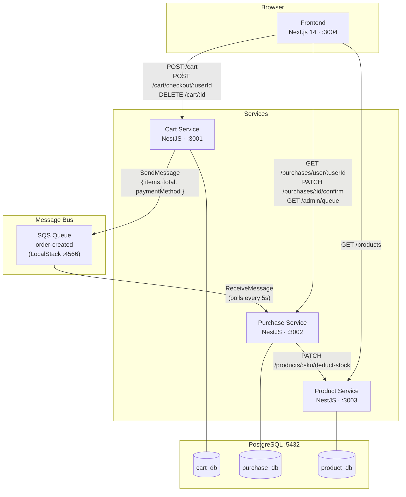
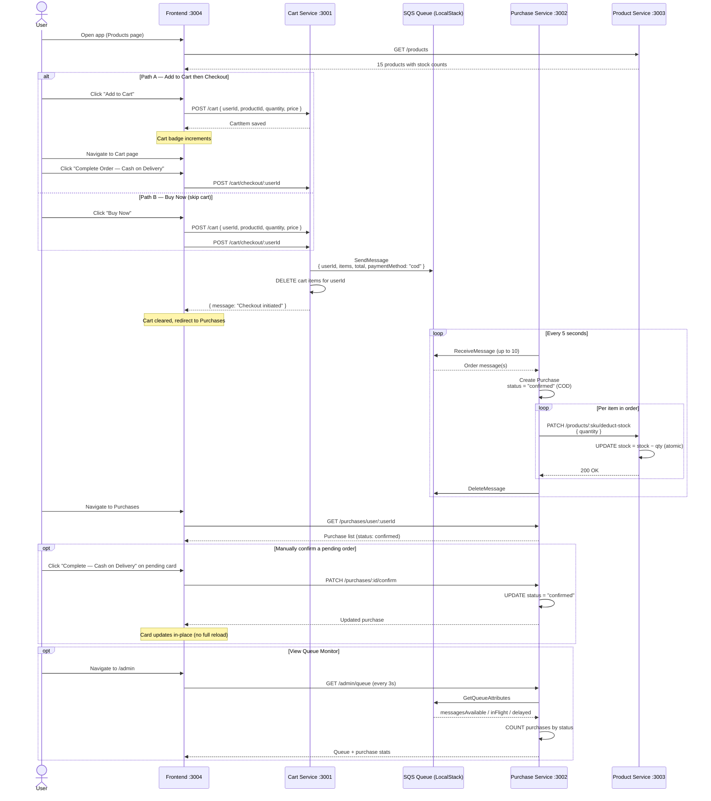
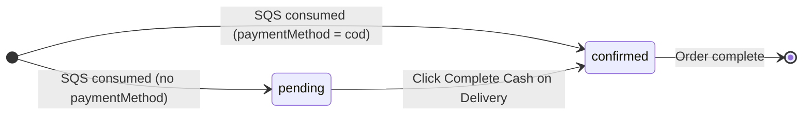
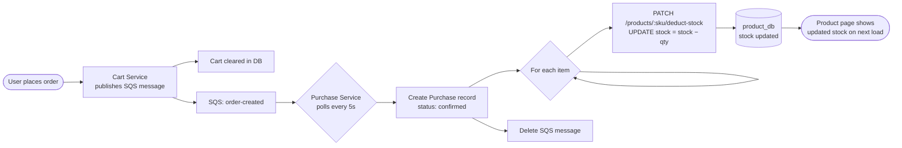

# Message Queue Demo — Microservices with NestJS + SQS + LocalStack

A full-stack microservices demo using NestJS (Fastify), PostgreSQL, AWS SQS via LocalStack, and a Next.js frontend.

```
[Frontend :3004]
      │
      ├──► Product Service :3003 ──► product_db
      ├──► Cart Service    :3001 ──► cart_db ──► SQS (order-created)
      └──► Purchase Service:3002 ──► purchase_db ◄── SQS (polls every 5s)
                                        │
                                  [PostgreSQL :5432]
                                  [LocalStack  :4566]
```

---

## Services

| Service          | Port | Database    | Role                                            |
| ---------------- | ---- | ----------- | ----------------------------------------------- |
| cart-service     | 3001 | cart_db     | Manages cart, publishes SQS msg, clears cart    |
| purchase-service | 3002 | purchase_db | Polls SQS, creates purchases, exposes admin API |
| product-service  | 3003 | product_db  | Product catalog with auto-seed (15 products)    |
| frontend         | 3004 | —           | Next.js + Redux Toolkit UI                      |
| PostgreSQL       | 5432 | —           | Shared DB host (3 databases)                    |
| LocalStack       | 4566 | —           | AWS SQS locally                                 |
| pgAdmin          | 5050 | —           | DB admin UI                                     |

---

## System Diagrams

### Architecture Overview



---

### Full Order Flow — Sequence Diagram



---

### Purchase Status Flow



---

### Stock Deduction Flow



---

## Application Pages

| Page            | URL                             | Description                                          |
| --------------- | ------------------------------- | ---------------------------------------------------- |
| Product Listing | http://localhost:3004/          | Browse products, Add to Cart or Buy Now (COD)        |
| Shopping Cart   | http://localhost:3004/cart      | Review cart items, Complete Order — Cash on Delivery |
| Purchases       | http://localhost:3004/purchases | View orders, confirm pending orders with COD         |
| Queue Monitor   | http://localhost:3004/admin     | Live SQS queue stats — refreshes every 3s            |

---

## Order Flow

```
1. Browse Products (/)
        │
        ├── Add to Cart ──► Cart page ──► "Complete Order — Cash on Delivery"
        │                                        │
        └── Buy Now ──────────────────────────────┘
                                                 │
                              Cart Service publishes to SQS
                              (paymentMethod: 'cod', cart cleared immediately)
                                                 │
                              Purchase Service polls SQS every 5s
                              Creates purchase record as status: confirmed
                                                 │
                              Purchases page shows confirmed order
```

**Payment status:**

| Trigger                                       | Resulting status |
| --------------------------------------------- | ---------------- |
| Checkout / Buy Now (Cash on Delivery)         | `confirmed`      |
| Pending order → "Complete — Cash on Delivery" | `confirmed`      |

---

## API Reference

### Cart Service — :3001

| Method | Endpoint                 | Description                              |
| ------ | ------------------------ | ---------------------------------------- |
| POST   | `/cart`                  | Add item to cart                         |
| GET    | `/cart/:userId`          | Get cart items for a user                |
| DELETE | `/cart/:id`              | Remove a single cart item                |
| POST   | `/cart/checkout/:userId` | Checkout — publishes to SQS, clears cart |

### Purchase Service — :3002

| Method | Endpoint                  | Description                                   |
| ------ | ------------------------- | --------------------------------------------- |
| GET    | `/purchases`              | List all purchases                            |
| GET    | `/purchases/user/:userId` | Purchases for a specific user                 |
| GET    | `/purchases/:id`          | Single purchase by ID                         |
| PATCH  | `/purchases/:id/confirm`  | Confirm a pending purchase (Cash on Delivery) |
| GET    | `/admin/queue`            | SQS queue stats + purchase counts             |

### Product Service — :3003

| Method | Endpoint        | Description                                 |
| ------ | --------------- | ------------------------------------------- |
| GET    | `/products`     | All products (optional `?category=` filter) |
| GET    | `/products/:id` | Single product by ID                        |

---

## Prerequisites

### macOS

```bash
# Install Homebrew (if not installed)
/bin/bash -c "$(curl -fsSL https://raw.githubusercontent.com/Homebrew/install/HEAD/install.sh)"

# Node.js 20+
brew install node

# Docker Desktop
brew install --cask docker
# Then open Docker Desktop app and start it

# AWS CLI v2
brew install awscli

# Yarn
npm install -g yarn
```

### Linux (Ubuntu/Debian)

```bash
# Node.js 20+
curl -fsSL https://deb.nodesource.com/setup_20.x | sudo -E bash -
sudo apt-get install -y nodejs

# Docker Engine + Docker Compose
sudo apt-get update
sudo apt-get install -y ca-certificates curl gnupg
sudo install -m 0755 -d /etc/apt/keyrings
curl -fsSL https://download.docker.com/linux/ubuntu/gpg | sudo gpg --dearmor -o /etc/apt/keyrings/docker.gpg
echo "deb [arch=$(dpkg --print-architecture) signed-by=/etc/apt/keyrings/docker.gpg] https://download.docker.com/linux/ubuntu $(lsb_release -cs) stable" | sudo tee /etc/apt/sources.list.d/docker.list
sudo apt-get update
sudo apt-get install -y docker-ce docker-ce-cli containerd.io docker-compose-plugin
sudo usermod -aG docker $USER   # log out and back in after this

# AWS CLI v2
curl "https://awscli.amazonaws.com/awscli-exe-linux-x86_64.zip" -o "awscliv2.zip"
unzip awscliv2.zip && sudo ./aws/install && rm -rf awscliv2.zip aws/

# Yarn
npm install -g yarn
```

### Windows

> Run all commands in **PowerShell (as Administrator)** or **Git Bash**.

```powershell
# Install winget (comes pre-installed on Windows 11)
# Or install manually from the Microsoft Store

# Node.js 20+
winget install OpenJS.NodeJS.LTS

# Docker Desktop (requires WSL2)
winget install Docker.DockerDesktop
# Restart your PC, then open Docker Desktop and complete setup

# AWS CLI v2
winget install Amazon.AWSCLI

# Yarn
npm install -g yarn

# Git Bash (recommended for running bash-like commands)
winget install Git.Git
```

> **Windows note:** Use **Git Bash** for all subsequent commands. PowerShell works too but paths and some commands differ.

---

## Setup

### 1. Clone the Repository

```bash
git clone <repository-url>
cd message_queue
```

### 1a. Install Root Dev Tooling

Run this once after cloning. It installs Husky, lint-staged, commitlint, ESLint, and Prettier at the root level and registers the Git hooks automatically.

```bash
npm install
```

> This triggers the `prepare` script which runs `husky` and activates the `pre-commit` and `commit-msg` hooks.

### 2. Start Docker Infrastructure

```bash
docker-compose up -d
```

This starts:

- PostgreSQL with `cart_db`, `purchase_db`, and `product_db` pre-created
- LocalStack (SQS)
- pgAdmin

Verify all containers are healthy:

```bash
docker-compose ps
```

Expected output — all three should show `healthy` or `running`:

```
NAME              STATUS
mq_postgres       Up (healthy)
mq_localstack     Up (healthy)
mq_pgadmin        Up
```

> **Linux only:** If you see a permission error on `init-db.sh`, run:
>
> ```bash
> chmod +x scripts/init-db.sh
> docker-compose down -v && docker-compose up -d
> ```

### 3. Create the SQS Queue

Run once after LocalStack starts:

```bash
aws --endpoint-url=http://localhost:4566 sqs create-queue \
  --queue-name order-created \
  --region us-east-1
```

> If you don't have AWS credentials configured, set dummy ones first:
>
> ```bash
> aws configure set aws_access_key_id test
> aws configure set aws_secret_access_key test
> aws configure set region us-east-1
> ```

Verify the queue was created:

```bash
aws --endpoint-url=http://localhost:4566 sqs list-queues --region us-east-1
```

---

## Install & Run Each Service

Open **4 separate terminal windows/tabs**, one per service.

### Terminal 1 — Cart Service (Port 3001)

```bash
cd cart-service
npm install
npm run typeorm:run-migrations
npm run start:dev
```

### Terminal 2 — Purchase Service (Port 3002)

```bash
cd purchase-service
npm install
npm run typeorm:run-migrations
npm run start:dev
```

### Terminal 3 — Product Service (Port 3003)

```bash
cd product-service
npm install
npm run typeorm:run-migrations
npm run start:dev
```

> The Product Service automatically seeds **15 products** on first startup using `INSERT ... ON CONFLICT DO NOTHING` — safe to restart without duplicating data.

### Terminal 4 — Frontend (Port 3004)

```bash
cd frontend
yarn install
yarn dev
```

Open **http://localhost:3004** in your browser. The landing page is the **Product Listing**.

---

## pgAdmin — Database UI

1. Open **http://localhost:5050**
2. Login: `admin@admin.com` / `admin`
3. Right-click **Servers** → **Register** → **Server...**
4. Fill in:

| Tab        | Field          | Value                                                                     |
| ---------- | -------------- | ------------------------------------------------------------------------- |
| General    | Name           | `message_queue`                                                           |
| Connection | Host           | `host.docker.internal` (Mac/Windows) or the postgres container IP (Linux) |
| Connection | Port           | `5432`                                                                    |
| Connection | Maintenance DB | `postgres`                                                                |
| Connection | Username       | `postgres`                                                                |
| Connection | Password       | `postgres`                                                                |

> **Linux users:** `host.docker.internal` may not resolve. Use the container IP instead:
>
> ```bash
> docker inspect mq_postgres --format '{{range .NetworkSettings.Networks}}{{.IPAddress}}{{end}}'
> ```

---

## Git Workflow & Commit Convention

### Conventional Commits

All commit messages must follow the [Conventional Commits](https://www.conventionalcommits.org/) format.
The `commit-msg` hook enforces this automatically on every `git commit`.

```
<type>(<optional scope>): <description>
```

**Allowed types:**

| Type       | When to use                                      |
| ---------- | ------------------------------------------------ |
| `feat`     | A new feature                                    |
| `fix`      | A bug fix                                        |
| `docs`     | Documentation changes only                       |
| `style`    | Formatting, missing semicolons — no logic change |
| `refactor` | Code change that is neither a fix nor a feature  |
| `test`     | Adding or updating tests                         |
| `chore`    | Build process, dependency updates, tooling       |
| `ci`       | CI/CD configuration changes                      |
| `perf`     | Performance improvements                         |
| `revert`   | Reverts a previous commit                        |

**Examples:**

```bash
# ✅ Valid
git commit -m "feat(cart): add quantity validation on checkout"
git commit -m "fix(sqs): handle empty queue response gracefully"
git commit -m "docs: update setup instructions for Linux"
git commit -m "chore: upgrade TypeORM to 0.3.20"
git commit -m "refactor(purchase): simplify SQS polling logic"

# ❌ Rejected — hook will block the commit
git commit -m "updated stuff"
git commit -m "WIP"
git commit -m "fix"
```

---

### Pre-commit Hook — Linting

Before every commit, `lint-staged` automatically lints only the **staged files**:

| Staged files                                | Action             |
| ------------------------------------------- | ------------------ |
| `cart/purchase/product-service/src/**/*.ts` | `eslint --fix`     |
| `frontend/src/**/*.{ts,tsx}`                | `next lint`        |
| `**/*.{json,md,yml,yaml}`                   | `prettier --write` |

If ESLint finds errors it cannot auto-fix, the commit is blocked. Fix the errors and re-stage before committing.

---

### Linting Commands

Run linting manually at any time:

```bash
# From root — lint all NestJS services
npm run lint:services

# From root — lint frontend
npm run lint:frontend

# From root — auto-fix NestJS services
npm run lint:fix

# From root — format all files with Prettier
npm run format

# From inside a service directory
npm run lint
npm run lint:fix

# Frontend
cd frontend && yarn lint
cd frontend && yarn lint:fix
```

---

### Typical Commit Workflow

```bash
# 1. Make your changes
# 2. Stage only what you intend to commit
git add cart-service/src/cart/cart.service.ts

# 3. Commit — hooks run automatically:
#    pre-commit  → lint-staged lints staged files
#    commit-msg  → commitlint validates the message format
git commit -m "feat(cart): add item quantity limit per user"

# 4. Push
git push origin main
```

---

## Migration Commands

Run these inside any service directory when you change an entity:

```bash
# Generate a new migration from entity changes
npm run typeorm:generate-migration

# Apply pending migrations
npm run typeorm:run-migrations

# Roll back the last migration
npm run typeorm:revert-migration
```

---

## Testing the Full Flow

### Via the UI

1. Open **http://localhost:3004** — you land on the Product Listing page
2. Browse products by category (Electronics, Accessories, Audio, Storage)
3. Click **Add to Cart** to add items, then go to **Cart** → **Complete Order — Cash on Delivery**
4. Or click **Buy Now** on any product card to skip the cart and place the order immediately
5. Navigate to **Purchases** — your order appears within ~5 seconds as `confirmed`
6. Any orders still showing `pending` can be confirmed using the **Complete — Cash on Delivery** button on the purchase card
7. Click **Queue Monitor** in the navbar to see live SQS queue depth and purchase stats

### Via curl

```bash
# 1. Add items to cart
curl -X POST http://localhost:3001/cart \
  -H "Content-Type: application/json" \
  -d '{"userId":"user1","productId":"ELEC-001","quantity":1,"price":1299.99}'

curl -X POST http://localhost:3001/cart \
  -H "Content-Type: application/json" \
  -d '{"userId":"user1","productId":"AUD-002","quantity":2,"price":149.99}'

# 2. View cart
curl http://localhost:3001/cart/user1

# 3. Checkout — publishes to SQS, clears cart in DB
curl -X POST http://localhost:3001/cart/checkout/user1

# 4. Wait ~5 seconds (Purchase Service polls SQS every 5s)

# 5. View purchases (status will be "confirmed" for COD orders)
curl http://localhost:3002/purchases/user/user1

# 6. Confirm a pending purchase manually
curl -X PATCH http://localhost:3002/purchases/<purchase-id>/confirm

# 7. View all products
curl http://localhost:3003/products

# 8. Filter by category
curl "http://localhost:3003/products?category=Electronics"

# 9. Check SQS queue stats
curl http://localhost:3002/admin/queue
```

---

## Project Structure

```
message_queue/
├── docker-compose.yml          # PostgreSQL + LocalStack + pgAdmin
├── scripts/
│   └── init-db.sh              # Creates cart_db, purchase_db, product_db
├── cart-service/               # NestJS · Port 3001
│   └── src/
│       ├── cart/               # Entity, Controller, Service, Module
│       ├── sqs/                # SQS publisher
│       └── migrations/
├── purchase-service/           # NestJS · Port 3002
│   └── src/
│       ├── purchase/           # Entity, Controller, Service, Module
│       ├── sqs/                # SQS consumer (polls every 5s)
│       ├── admin/              # Queue stats admin endpoint
│       └── migrations/
├── product-service/            # NestJS · Port 3003
│   └── src/
│       ├── product/            # Entity, Controller, Service, Module
│       ├── seed/               # Auto-seeds 15 products on startup
│       └── migrations/
└── frontend/                   # Next.js 14 · Port 3004
    └── src/
        ├── app/                # App Router pages (/, /cart, /purchases, /admin)
        ├── components/         # Navbar, ProductCard, CartList, PurchaseCard
        ├── store/              # Redux Toolkit slices (cart, purchases, user)
        └── lib/                # API client functions
```

---

## Environment Variables

Each service has a `.env` file. Default values work out of the box with the provided `docker-compose.yml`.

| Variable        | cart-service                                     | purchase-service      | product-service |
| --------------- | ------------------------------------------------ | --------------------- | --------------- |
| `DB_HOST`       | localhost                                        | localhost             | localhost       |
| `DB_PORT`       | 5432                                             | 5432                  | 5432            |
| `DB_NAME`       | cart_db                                          | purchase_db           | product_db      |
| `DB_USERNAME`   | postgres                                         | postgres              | postgres        |
| `DB_PASSWORD`   | postgres                                         | postgres              | postgres        |
| `SQS_ENDPOINT`  | http://localhost:4566                            | http://localhost:4566 | —               |
| `SQS_QUEUE_URL` | http://localhost:4566/000000000000/order-created | ← same                | —               |
| `PORT`          | 3001                                             | 3002                  | 3003            |

---

## Troubleshooting

**`docker-compose up` fails — port already in use**

```bash
# Find and kill the process using the port (e.g. 5432)
# macOS / Linux:
lsof -ti:5432 | xargs kill -9
# Windows (PowerShell):
netstat -ano | findstr :5432
# then: taskkill /PID <pid> /F
```

**SQS queue not found when starting services**

```bash
# Re-create the queue
aws --endpoint-url=http://localhost:4566 sqs create-queue --queue-name order-created --region us-east-1
```

**`nest` command not found**

```bash
npm install -g @nestjs/cli
```

**`yarn` command not found**

```bash
npm install -g yarn
```

**Migrations fail — database does not exist**

```bash
# Manually create missing databases
docker exec mq_postgres psql -U postgres -c "CREATE DATABASE product_db;"
```

**Frontend shows "Could not load products"**
Make sure the Product Service is running on port 3003 before opening the frontend.

**Queue Monitor shows an error**
Make sure the Purchase Service is running on port 3002.

**Windows — `chmod` not found**
The `chmod` command in `scripts/init-db.sh` is irrelevant on Windows. Docker Desktop handles script permissions automatically.

---

## Tech Stack

| Layer        | Technology                                       |
| ------------ | ------------------------------------------------ |
| Backend      | NestJS 10, Fastify, TypeORM 0.3                  |
| Database     | PostgreSQL 15                                    |
| Message Bus  | AWS SQS via LocalStack                           |
| Frontend     | Next.js 14, React 18, Redux Toolkit              |
| Styling      | Tailwind CSS 3                                   |
| DevOps       | Docker, Docker Compose                           |
| Code Quality | ESLint, Prettier, Husky, lint-staged, commitlint |
